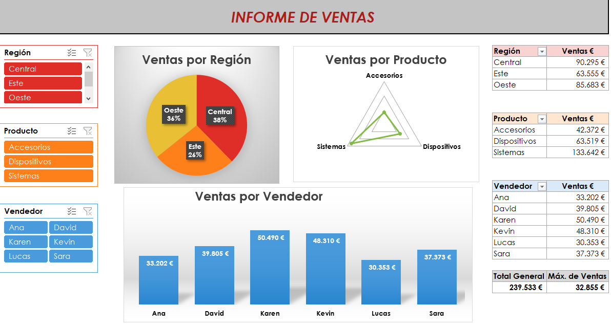

# Dashboard_Ventas
Panel de Control sobre Ventas

## Introduction
Primer proyecto de una serie de prácticas realizadas con diferentes programas para la realización de Paneles de Control.

Actualmente esta realizado con Excel y Power BI.

[Excel](##Excel)

[Power BI](##PowerBI)

## Explicación
Este proyecto consiste en obtener un Panel de Control con los datos de ventas disponibles. Para ello utilizaremos diferentes programas para intertar realizar el mismo panel.

Estos datos nos da información sobre la Región, Producto, Vendedor y Ventas, de una empresa ficticia.

A partir de estos datos se va realizar un panel de control interactivo para la visualización de los datos mostrados.

##Excel

[Archivo Excel](https://github.com/ntr94/Dashboard_Ventas/blob/main/Excel/Infome_Ventas_Excel.xlsx)

## Power BI

[Archivo Power BI](https://github.com/ntr94/Dashboard_Ventas/blob/main/Power%20BI/Infome_Ventas_PowerBI.pbix)
