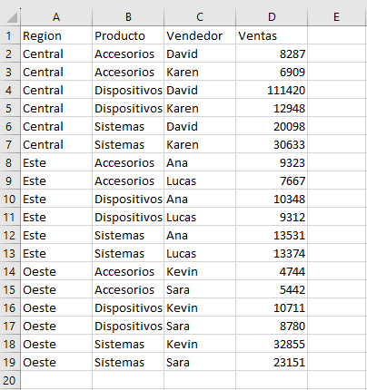

# Dashboard_Ventas
Panel de Control sobre Ventas

## Introduction
Primer proyecto de una serie de prácticas realizadas con diferentes programas para la realización de Paneles de Control.

## Explicación
Este proyecto consiste en obtener un Panel de Control con los datos de ventas disponibles.

Estos datos nos da información sobre la Región, Producto, Vendedor y Ventas, de una empresa ficticia.
